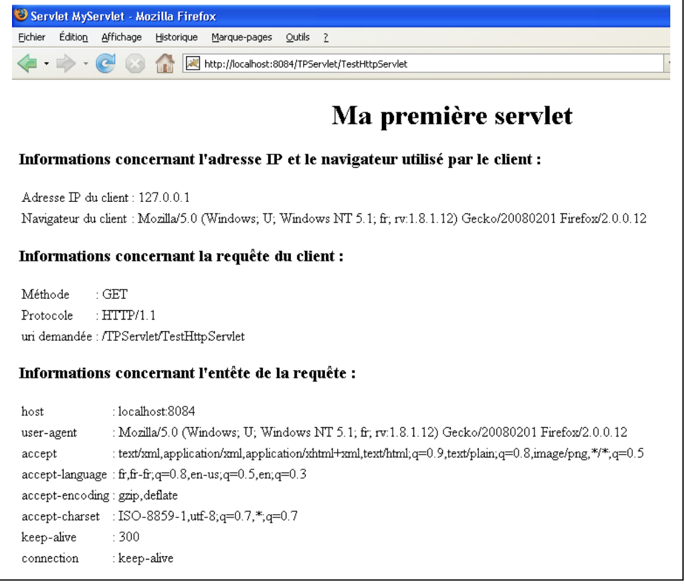

# TP01: Manipuler les servlets
Dans ce TP, nous allons expérimenter les HttpServlets. 

## Partie 1: Créer une application de test 
- Sur Netbeans, créer une application de test et nommez-la TP01_[NOM_PRENOM]. 
- Veillez à remplir tous les champs demandées par l'utilitaire Netbeans --> Ne pas laisser les valeurs par défaut. 
- Initialisez le versionning (obligatoirement git)
- Compilez et testez le projet 
- Commitez et push vos changements

## Partie 2. Manipuler une servlet 
Dans cette partie, nous allons principalement 
- ajouter une servlet au projet 
- tester les principales méthodes/actions de la servlet
- tester les propriétés d'une requête HTTP 

### Ajoutez une servlet
1. Ajoutez une servlet au projet 
    - Nom de la servlet ExperimentServlet
    - url d'accès : /experiment
2. Compilez et testez
3. Notez votre observation dans le fichier readme du projet
    - Quelles méthodes sont supportées par la servlet 
    - Que se passe t il lors des actions suivantes : GET, POST, PUT, DELETE
4. Commitez et push vos changements

### Tester les propriétés des requêtes HTTP

1. Ajoutez au fur et à mesure les fonctionnalités permettant de transformer la réponse de la servlet comme sur la figure ci-après


2. Commitez et push vos changements


## Partie 3: Gestion d'une liste d'étudiants 
Dans cette partie, nous allons ajouter une nouvelle fonctionnalité permettant de gérer une liste d'étudiants en utilisant uniquement une servlet et un fichier csv. 

### Sauvergarder des étudiants dans un fichier csv
1. Ajoutez une nouvelle servlet
    - Nom de la servlet : EtudiantsServlet
    - url d'accès : /etudiants

2. Ajoutez un formulaire HTML comme avec les élements suivantes 
Nom: Champ de texte 
Prénom: Champ de texte
Email: Champ de texte
Sauvegarder: Bouton 

3. Quand l'utilisateur clique sur le bouton sauvegarder, applez la méthode ```doPost``` de la servlet. 

4. Modifiez la méthode ```doPost``` de la servlet pour récupérer les informations du formulaire et les sauvegarder dans un fichier ```etudiants.csv```

5. Compilez et testez 

6. Ou se trouve le fichier ```etudiants.csv``` ? Savez-vous pourquoi?

7. Commit et push vos changements

### Afficher la liste des étudiants

1. Modifiez la methode ```doGet``` de la servlet pour
afficher la liste des étudiants sous forme d'un tableau HTML. 

2. Modifiez la methode ```doPost``` de la servlet pour rediriger vers la liste après la création d'un étudiant.

3. Ajoutez un tableau avant le tableau contenant la liste des étudiants pour rediriger vers le formulaire de création d'un étudiant. 

4. Commit, push


### Rendre votre TP
Complétez le tableau TP01 du document ci-après pour y inclure, vos noms, prénoms et lien vers le repository du TP. 


