# TP Applications web : utilisation d'une base de données

## Création d'un projet
A l'aide de Netbeans, vous allez créer un nouveau projet de type "java web/web application". Lors de la création une des étapes correspond à l'écran suivant. Précisez bien que vous allez utiliser glassfish, que vous allez faire du Java EE 7 et que vous voulez utiliser l'injection de code dans les sources du projet. 

>> Rappel : l'injection de code est le fait d'utiliser des annotations de code et de pouvoir utiliser des variables sans les avoir initialisées au préalable.

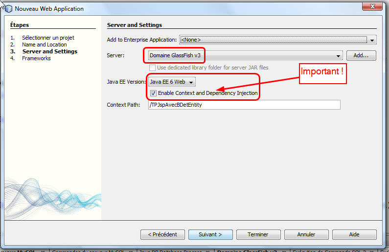

## Création d'une base de données vide

Dans ce TP nous allons réaliser une version modifiée du TP3 sur le gestionnaire d'utilisateurs, à la différence près que nous allons utiliser une vraie base de données relationnelle en lieu et place de la base de données XML du TP3. Nous allons donc créer une base de données vide (sans tables) pour nos utilisateurs.

Allez dans l'onglet "services" et cliquez avec le bouton de droite sur l'icone "JavaDB" qui est le SGBD livré d'origine avec le JDK. Il s'agit d'un véritable SGBD, complet, écrit en java, livré avec la distribution Java EE 7. Il s'appelle Derby. Pour information, les bases sont stockées sous windows dans le répertoire .netbeans-derby situé sous documents and settings/user/<votre nom>...

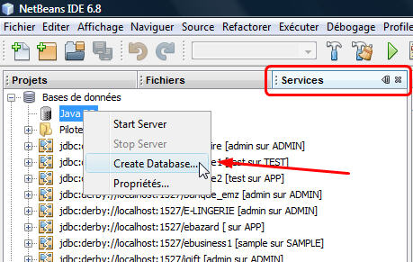

Appelez la base comme vous voulez, je l'ai appelée "utilisateurs". Mettez un login et un mot de passe, c'est obligatoire si vous voulez éviter des déboires par la suite (notez que la dernière ligne vous indique le chemin du répertoire de la base)

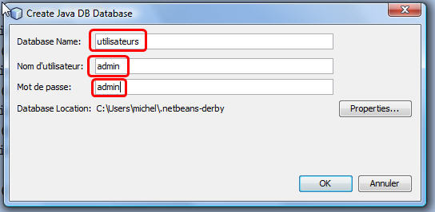

Une connexion est automatiquement ajoutée à la liste des connexions dans l'onglet "services", cette "connexion" vous permettra d'administrer la base de données depuis netbeans, qui contient un outil très pratique pour cela (et qui marche avec tout type de SGBD : MySQL, etc.). Faites clic droit / se connecter :

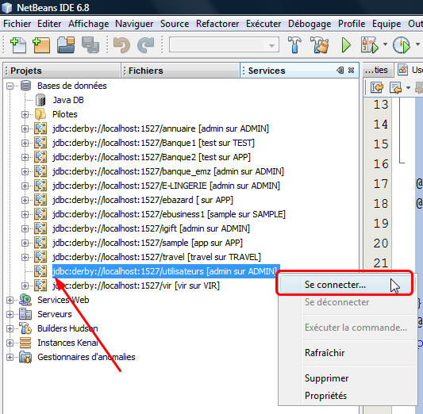

>> La connexion est maintenant exploitable en cliquant sur le petit "+", pour le moment, rien d'intéressant dedans, elle est vide ! Pas de tables, rien !


## Création d'un modèle (classe entité) d'Utilisateur et d'un gestionnaire de persistence

Nous allons maitenant ajouter une classe "modèle" à notre projet. On l'appellera "Utilisateur". Les modèles ont toujours un nom, en gros le nom de la table dans laquelle les instances de ce modèle seront stockées. Pour créer un modèle : clic droit sur le projet et nouveau/classe entité :

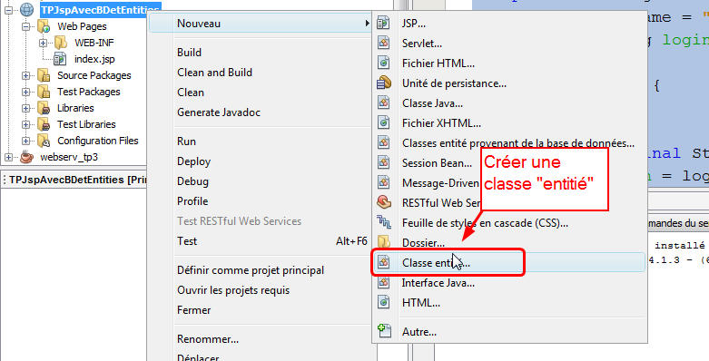

Vous appelerez ce modèle "Utilisateur" (et pas User car User est un mot clé reservé SQL et cela peut poser problème), le placerez dans le package utilisateurs.modeles, lui donnerez comme clé primaire un type int ou long (plus facile à gérer que Integer ou Long), et pour finir vous allez créer une "unité de persistance". Selon les versions de netbeans, il se peut que ce bouton "créer une unité de persistance" ne soit pas dans le wizard à cet endroit-là mais il sera proposé de créer cette unité de persistence dans l'étape suivante du wizard.

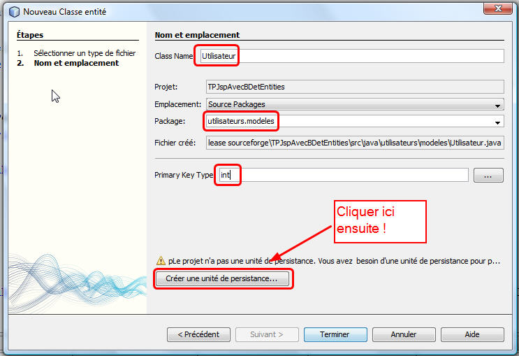

>> L'unité de persistance est l'outil qui va faire la connexion avec la base de données et qui servira à générer automatiquement les requêtes SQL. Il utilisera en coulisse un outil de mapping relationnel / objet (ici EclipseLink, mais déroulez le menu, vous verrez qu'on a le choix) :

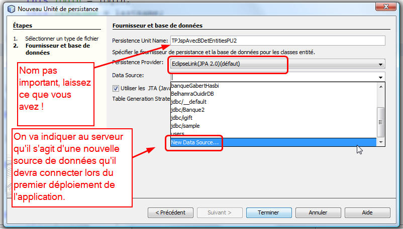

On précise ensuite pour la nouvelle source de données que le serveur va connecter, un nom "logique", qui est libre, c'est le nom "au sens de JNDI", l'API de Java qui permet de "nommer" des ressources. On choisit parmi les connexions ouvertes dans netbeans celle qui correspond à la base sur laquelle l'application va travailler. Ici on dit que le base dont le nom est "BaseUsers" est en réalité une base Derby, sur localhost, port 1527. Le login et le password seront récupérés par netbeans et seront ajouté à un fichier de config xml que nous verrons un peu plus loin.

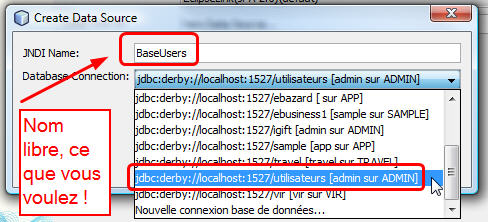

Enfin, on peut indiquer à l'unité de persistance sa "stratégie" : lorsqu'on déploie l'application on lui demande de supprimer les tables et de les recréer automatiquement. Cette stratégie est utile lorsque les tables sont créées à partir des classes et que le contenu des classes modèles peut évoluer. Une fois les modèles figés, en général on passe en mode "ne rien modifier", ou juste "créer" ce qui ne permettra que de rajouter des tables lorsqu'on crééera de nouveaux modèles :

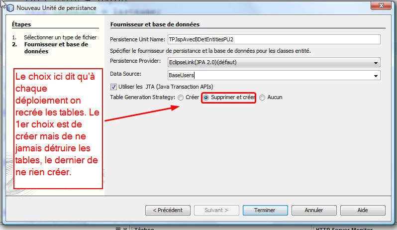

Finalement, après ces étapes, on obtient à la fois une classe modèle pour les utilisateurs (on les appelle des "classes entités", Entity en anglais, ou des "EJB entity"...) et des fichiers de description XML à la fois pour l'unité de persistance et pour la source de données qu'on va déployer sur le serveur (fichier persistence.xml sous "configuration" dans le projet, c'est un fichier standard de java EE), et un fichier glassfish-resources.xml, propre à Glassfish, sous "server-resources" dans le projet.

Regardez ci-dessous le code de l'entité générée, noter les annotations de code @Entity (qui dit : attention, se mappe sur une table ayant le même nom, mais tout en majuscule, ici la table UTILISATEUR), @Id qui indique la clé primaire, et @GeneratedValue(...) qui indique que l'on veut une clé auto-incrémentée :

```Java
@Entity
public class Utilisateur implements Serializable {

    private static final long serialVersionUID = 1L;
    @Id
    @GeneratedValue(strategy = GenerationType.AUTO)
    private int id;
    private String firstname;
    private String lastname;
    private String login;

    public Utilisateur() {
    }

    public Utilisateur (final String login, final String lastname, final String firstname) {
        this.login = login;
        this.lastname = lastname;
        this.firstname = firstname;
    }
...
```
Notons également les fichiers XML générés. Persistence.xml correspond au gestionnaire de persistance. Vous pouvez double-cliquer dessus pour obtenir la fenêtre d'édition, aller voir le source XML :

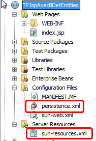

>> persistence.xml est un fichier standard Java EE, alors que le fichier sun-resource.xml (ou glassfish-resources, selon les versions de glmassfish) est propriétaire et spécifique au serveur glassfish, ouvrez-le, il indique à glassfish que l'on déploie une source de données avec l'application et que l'on désire qu'il s'y connecte, s'il ne l'a pas déjà dans sa liste. Le lien entre les deux c'est le nom JNDI de la base. Regardez les sources des fichiers XML pour vous faire une idée !


## Complétons la classe entité avec des constructeurs, des accesseurs, des modifieurs

Ajoutez maitenant un constructeur avec paramètres et un constructeur sans paramètre (obligatoire pour les beans), des accesseurs et des modifieurs (clic droit, insérer du code/getter and setter). Vous pouvez utiliser le raccourcis clic/droit/insérer du code/add property (aussi appelable par alt-insert je crois).

```Java
@Entity
public class Utilisateur implements Serializable {

    private static final long serialVersionUID = 1L;
    @Id
    @GeneratedValue(strategy = GenerationType.AUTO)
    private int id;
    private String firstname;
    private String lastname;
    private String login;

       public Utilisateur() {
    }

    public Utilisateur(final String login, final String lastname, final String firstname) {
        this.login = login;
        this.lastname = lastname;
        this.firstname = firstname;
    }

    public String getFirstname() {
        return firstname;
    }

    public void setFirstname(String firstname) {
        this.firstname = firstname;
    }

...
```
>> En général dans les modèles ont ne rajoute pas grand chose à part des getters et des setters...


## Ajout d'un gestionnaire d'utilisateurs

Vous devez commencer à être habitués à ce genre d'architecture. Devant un modèle on met un "handler" ou "une façade" ou un "Data Access Object (DAO)", ou un "gestionnaire"...  Ici on va créer une classe GestionnaireUtilisateur. Comme on fait du java EE "moderne", on va utiliser un composant spécial appelé un Enterprise Java Bean stateless (cours complet l'an prochain), c'est en gros une classe que l'on aura pas besoin d'instancier et qui nous permettra d'utiliser un entity manager facilement, grace à l'injection de code. On le déclare mais on n'a pas besoin de l'intitialiser (voir le cours qui montre un exemple d'utilisation d'un entity manager depuis un main et qui compare avec un session bean).

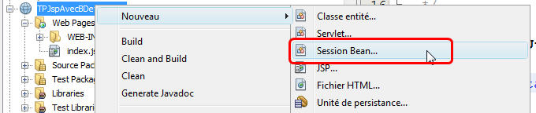

Puis pour l'étape suivante, donnez un nom et un package à votre EJB sessions :

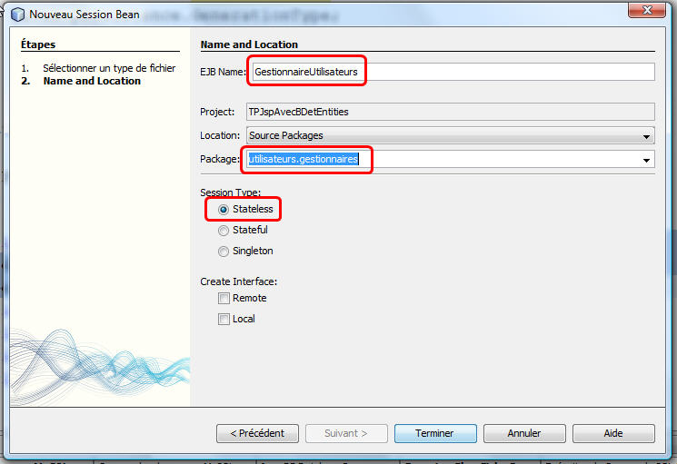

Cela va générer un code source GestionnaireUtilisateur relativement vide. Modifiez le pour qu'il ressemble à cela :

```Java
package utilisateurs.gestionnaires;

import java.util.Collection;
import javax.ejb.Stateless;
import javax.persistence.EntityManager;
import javax.persistence.PersistenceContext;
import javax.persistence.Query;
import utilisateurs.modeles.Utilisateur;

@Stateless
public class GestionnaireUtilisateurs {
    // Ici injection de code : on n'initialise pas. L'entity manager sera créé
    // à partir du contenu de persistence.xml
    @PersistenceContext
    private EntityManager em;

    public void creerUtilisateursDeTest() {
        creeUtilisateur("John", "Lennon", "jlennon");
        creeUtilisateur("Paul", "Mac Cartney", "pmc");
        creeUtilisateur("Ringo", "Starr", "rstarr");
        creeUtilisateur("Georges", "Harisson", "georgesH");
    }

    public Utilisateur creeUtilisateur(String nom, String prenom, String login) {
        Utilisateur u = new Utilisateur(nom, prenom, login);
        em.persist(u);
        return u;
    }

    public Collection<Utilisateur> getAllUsers() {
        // Exécution d'une requête équivalente à un select *
        Query q = em.createQuery("select u from Utilisateur u");
        return q.getResultList();
    }
    // Add business logic below. (Right-click in editor and choose
    // "Insert Code > Add Business Method")
}
```

>> ATTENTION : il ne faut pas inclure javax.management.Query mais javax.persistence.Query !!!!!

### Notez plusieurs choses :

1. C'est une classe java normale à part l'annotation @stateless qui indique que c'est une classe qui pourra être utilisée par injection de code, sans qu'on fasse de new (la servlet à suivre, l'utilisera de cette manière)

2. On a ajouté deux lignes pour définir un EntityManager, c'est en gros une instance de l'unité de persistence que l'on a créé plus tôt dans le TP. La variable "em" est en fait "le lien avec la base de données". Avec em on pourra envoyer des requêtes, insérer des objets, supprimer des objets dans la base. Note : on aurait pu utiliser un wizard en faisant clic droit/persistence dans le code et en choisissant "insérer un persistence manager".

3. La méthode creerUnUtilisateur créée de manière "normale" un utilisateur, l'insertion en base est réalisée par l'appel de em.persist(u);

4. La méthode getAllUsers() fait l'équivalent d'un select * SQL sauf qu'ici la requête dit "donne moi tous les objets u de type Utilisateur". On fait de la programmation objet, on ne manipule pas des tuples ! La valeur renvoyée par la requête est une collection d'Utilisateurs, soit une collection d'objets !

5. Le code est très simple et très propre !
Bien entendu, c'est ici que l'on rajoutera de la logique métier pour supprimer des utilisateurs, rechercher par nom, par login, par id, etc.

## Ecriture d'une Servlet / contrôleur web

Comme pour les tps précédents, on met devant le gestionnaire une servlet qui va servir d'interface de controle http. Faites clic droit sur le projet nouveau/servlet :

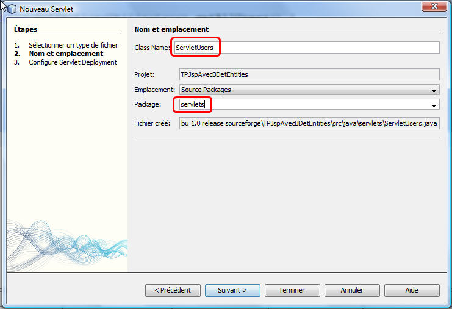

Dans le code, indiquez à la servlet qu'elle va utiliser le gestionnaire d'Utilisateurs. Dans le source, clic droit/insérer du code/call enterprise bean :

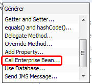

Choisissez le gestionnaire :

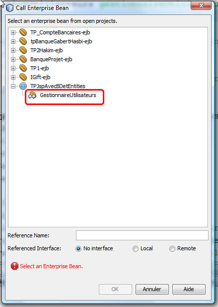

>> Notez l'ajout d'imports et d'une variable + une annotation de code dans votre Servlet :

```Java
@WebServlet(name = "ServletUsers", urlPatterns = {"/ServletUsers"})
public class ServletUsers extends HttpServlet {
    // ici injection de code ! On n'initialise pas !
    @EJB
    private GestionnaireUtilisateurs gestionnaireUtilisateurs;
```

La ligne @EJB dit qu'on ne veut pas s'occuper de créer à la main cette variable. Pas de new donc !

Maitenant on complète la servlet de manière très similaire à celle du TP3, pour qu'elle réponde à quelques actions de base comme "créer des utilisateurs de test" ou "renvoyer la liste des utilisateurs" :

```Java
/*
 * To change this template, choose Tools | Templates
 * and open the template in the editor.
 */
package servlets;

import java.io.IOException;
import java.util.Collection;
import javax.ejb.EJB;
import javax.servlet.RequestDispatcher;
import javax.servlet.ServletException;
import javax.servlet.annotation.WebServlet;
import javax.servlet.http.HttpServlet;
import javax.servlet.http.HttpServletRequest;
import javax.servlet.http.HttpServletResponse;
import utilisateurs.gestionnaires.GestionnaireUtilisateurs;
import utilisateurs.modeles.Utilisateur;

/**
 *
 * @author michel
 */
@WebServlet(name = "ServletUsers", urlPatterns = {"/ServletUsers"})
public class ServletUsers extends HttpServlet {
    // ici injection de code ! On n'initialise pas !
    @EJB
    private GestionnaireUtilisateurs gestionnaireUtilisateurs;

    /**
     * Processes requests for both HTTP <code>GET</code> and <code>POST</code> methods.
     * @param request servlet request
     * @param response servlet response
     * @throws ServletException if a servlet-specific error occurs
     * @throws IOException if an I/O error occurs
     */
    protected void processRequest(HttpServletRequest request, HttpServletResponse response)
            throws ServletException, IOException {
        // Pratique pour décider de l'action à faire
        String action = request.getParameter("action");
        String forwardTo = "";
        String message = "";

        if (action != null) {
            if (action.equals("listerLesUtilisateurs")) {
                Collection<Utilisateur> liste = gestionnaireUtilisateurs.getAllUsers();
                request.setAttribute("listeDesUsers", liste);
                forwardTo = "index.jsp?action=listerLesUtilisateurs";
                message = "Liste des utilisateurs";
            } else if (action.equals("creerUtilisateursDeTest")) {
                  gestionnaireUtilisateurs.creerUtilisateursDeTest();
                Collection<Utilisateur> liste = gestionnaireUtilisateurs.getAllUsers();
                request.setAttribute("listeDesUsers", liste);
                forwardTo = "index.jsp?action=listerLesUtilisateurs";
                message = "Liste des utilisateurs";
            } else {
                forwardTo = "index.jsp?action=todo";
                message = "La fonctionnalité pour le paramètre " + action + " est à implémenter !";
            }
        }

        RequestDispatcher dp = request.getRequestDispatcher(forwardTo + "&message=" + message);
        dp.forward(request, response);
        // Après un forward, plus rien ne peut être exécuté après !
    }
......... suite du code .....
  
}
```

## Modification de index.jsp en front-end

Ah ah !!!! Eh bien on reprend telle qu'elle la JSP du TP3 ! Aucune modification, rien !

```Html
<%--
    Document   : index
    Created on : 16 sept. 2009, 16:54:32
    Author     : michel buffa
--%>

<%@page contentType="text/html" pageEncoding="UTF-8"%>
<!DOCTYPE HTML PUBLIC "-//W3C//DTD HTML 4.01 Transitional//EN"
    "http://www.w3.org/TR/html4/loose.dtd">

<!-- Ne pas oublier cette ligne sinon tous les tags de la JSTL seront ignorés ! -->
<%@taglib uri="http://java.sun.com/jsp/jstl/core" prefix="c"%>

<html>
    <head>
        <meta http-equiv="Content-Type" content="text/html; charset=UTF-8">
        <title>Gestionnaire d'utilisateurs</title>
    </head>
    <body>
        <h1>Gestionnaire d'utilisateurs</h1>


        <!-- Message qui s'affiche lorsque la page est appelé avec un paramètre http message -->
        <c:if test="${!empty param['message']}">
            <h2>Reçu message : ${param.message}</h2>
        </c:if>


        <h2>Menu de gestion des utilisateurs</h2>
        <ul>
            <li><a href="ServletUsers?action=listerLesUtilisateurs">Afficher/raffraichir la liste de tous les utilisateurs</a></li>
            <p>
        </ul>
            <h2>Liste des fonctionnalités à implémenter dans la Servlet (note : après chaque action cette page sera
                rappelée par la servlet avec la liste des utilisateurs raffraichie et un message de confirmation</h2>
        <ol>
            <li><a href="ServletUsers?action=creerUtilisateursDeTest">Créer 4 utilisateurs de test</a></li>

            <li>Créer un utilisateur</li>
            <form action="ServletUsers" method="get">
                Nom : <input type="text" name="nom"/><br>
                Prénom : <input type="text" name="prenom"/><br>
                Login : <input type="text" name="login"/><br>
                <!-- Astuce pour passer des paramètres à une servlet depuis un formulaire JSP !-->
                <input type="hidden" name="action" value="creerUnUtilisateur"/>
                <input type="submit" value="Créer l'utilisateur" name="submit"/>
            </form>

            <li>Afficher les détails d'un utilisateur</li>
            <form action="ServletUsers" method="get">
                login : <input type="text" name="login"/><br>
                <input type="hidden" name="action" value="chercherParLogin"/>
                <input type="submit" value="Chercher" name="submit"/>
            </form>


            <li>Modifier les détails d'un utilisateur :</li>
            <form action="ServletUsers" method="get">
                Login : <input type="text" name="login"/><br>
                Nom : <input type="text" name="nom"/><br>
                Prénom : <input type="text" name="prenom"/><br>
                <input type="hidden" name="action" value="updateUtilisateur"/>
                <input type="submit" value="Mettre à jour" name="submit"/>
            </form>
        </ol>

        <!-- Fin du menu -->

        <!-- Zone qui affiche les utilisateurs si le paramètre action vaut listerComptes -->
        <c:if test="${param['action'] == 'listerLesUtilisateurs'}" >
            <h2>Liste des utilisateurs</h2>

            <table border="10">
                <!-- La ligne de titre du tableau des comptes -->
                <tr>
                    <td><b>Login</b></td>
                    <td><b>Nom</b></td>
                    <td><b>Prénom</b></td>
                </tr>

                <!-- Ici on affiche les lignes, une par utilisateur -->
                <!-- cette variable montre comment on peut utiliser JSTL et EL pour calculer -->
                <c:set var="total" value="0"/>

                <c:forEach var="u" items="${requestScope['listeDesUsers']}">
                    <tr>
                        <td>${u.login}</td>
                        <td>${u.firstname}</td>
                        <td>${u.lastname}</td>
                        <!-- On compte le nombre de users -->
                        <c:set var="total" value="${total+1}"/>
                    </tr>
                </c:forEach>

                <!-- Affichage du solde total dans la dernière ligne du tableau -->
                <tr><td><b>TOTAL</b></td><td></td><td><b>${total}</b></td><td></td></tr>
            </table>

        </c:if>
    </body>
</html>
```

## Executez le projet !

1. Dans la page d'accueil, la même que pour le TP2, commencez par cliquer sur "créer 4 utilisateurs de test", puis sur "afficher la liste des utilisateurs"... Si tout va bien cela devrait marcher. 

2. Allez voir dans l'onglet "services", ouvrez la connexion de votre base de données, regardez sous ADMIN (si cela n'apparait pas, faites clic droit/refresh), et sur la table UTILISATEURS, clic droit/voir les données... Vous verrez que cela fonctionne bien.


## A faire 
- Modifier le code de la servlet pour créer un nouvel utilisateur quand on clique sur le bouton ```créer un utilisateur```
